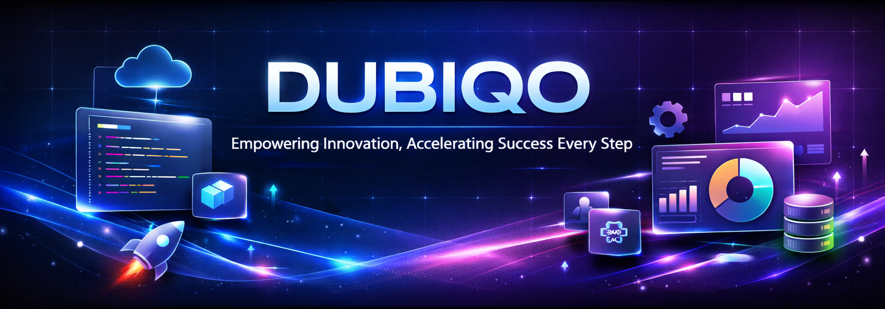

<div align="center">



# 🚀 DUBIQO

**Empowering Innovation, Accelerating Success Every Step**

*We build websites that build your business.*

[](https://github.com/bhataakib02/Dubiqo)
[](https://www.typescriptlang.org/)
[](https://react.dev/)
[](https://vitejs.dev/)
[](https://vercel.com/)

### 🛠️ Built With


[](https://postcss.org/)
[](https://tailwindcss.com/)
[](https://supabase.com/)

</div>

---

## 📋 Table of Contents

- [Overview](#-overview)
- [Features](#-features)
- [Tech Stack](#-tech-stack)
- [Quick Start](#-quick-start)
- [Project Structure](#-project-structure)
- [Authentication & Authorization](#-authentication--authorization)
- [Database Schema](#-database-schema)
- [Deployment](#-deployment)
- [Security](#-security)
- [Admin Portal](#-admin-portal)
- [Contributing](#-contributing)
- [Support](#-support)

---

## 🎯 Overview

**Dubiqo** is a complete, production-ready, enterprise-grade digital solutions platform built with modern web technologies. It provides a comprehensive system for managing client projects, quotes, bookings, invoices, support tickets, and content management.

### Key Highlights

- ✅ **Production Ready** - Fully functional enterprise platform
- ✅ **Type-Safe** - Built with TypeScript for reliability
- ✅ **Modern Stack** - React 18, Vite, Tailwind CSS, Supabase
- ✅ **Secure** - Row-Level Security (RLS) and RBAC
- ✅ **Scalable** - Serverless architecture with Edge Functions
- ✅ **SEO Optimized** - Built for search engine visibility
- ✅ **Responsive** - Mobile-first design approach

---

## ✨ Features

### 🌐 Public-Facing Pages

| Feature | Description |
|---------|-------------|
| **Landing Page** | Modern, conversion-optimized homepage |
| **Services** | Detailed service pages (Websites, Portfolios, Billing Systems, Dashboards, Troubleshooting, Maintenance) |
| **Portfolio** | Showcase of completed projects |
| **Case Studies** | In-depth project success stories |
| **Pricing** | Dynamic pricing plans management |
| **Blog** | Content management system for articles |
| **About** | Company information and team |
| **Contact** | Multiple contact methods and forms |
| **Quote Calculator** | Interactive quote estimation tool |
| **Booking System** | Consultation scheduling |
| **Downloads** | Resource library |
| **Legal Pages** | Privacy Policy, Terms, Refund Policy, SLA |

### 🔐 Authentication System

- **Unified Login** - Single sign-in for all user types
- **Auto-Redirect** - Intelligent routing based on user role
  - `admin`/`staff` → `/admin/dashboard`
  - `client` → `/client-portal`
- **OAuth Support** - Google and GitHub authentication
- **Email Verification** - Configurable email confirmation
- **Session Management** - Secure session handling via Supabase

### 👥 Role-Based Access Control (RBAC)

#### Client (Default Role)
- View own projects, quotes, and invoices
- Create and track support tickets
- Access client portal dashboard
- View project status and updates

#### Staff
- View all client data
- Manage projects, quotes, and bookings
- Respond to support tickets
- Access admin portal features
- Limited to assigned clients (data isolation)

#### Admin
- Full system access
- User and role management
- System configuration
- Audit log access
- Complete analytics dashboard

### 🎨 Admin Portal Features

> **Note:** Admin portal is hidden from public navigation and search engines

- **Dashboard** - Real-time statistics and overview
- **User Management** - Complete user administration
- **Project Management** - Track and manage all projects
- **Quote Management** - Handle quote requests
- **Booking Management** - Consultation scheduling
- **Invoice Management** - Billing and payment tracking
- **Ticket System** - Customer support management
- **Content Management** - Blog posts and case studies
- **Pricing Management** - Dynamic pricing plans
- **Analytics** - Usage and performance metrics
- **Audit Logs** - Security and activity tracking

### 🗄️ Database Features

- **PostgreSQL** - Robust relational database
- **Row-Level Security (RLS)** - Table-level access control
- **Real-time Subscriptions** - Live data updates
- **Edge Functions** - Serverless backend logic
- **File Storage** - Secure file management
- **Full-Text Search** - Advanced search capabilities

---

## 🛠️ Tech Stack

### Frontend

| Technology | Purpose |
|-----------|---------|
| **React 18** | UI framework with latest features |
| **TypeScript** | Type-safe development |
| **Vite** | Lightning-fast build tool |
| **Tailwind CSS** | Utility-first CSS framework |
| **Shadcn UI** | High-quality component library |
| **React Router v6** | Client-side routing |
| **React Hook Form** | Form state management |
| **Zod** | Schema validation |
| **Sonner** | Toast notifications |

### Backend (Supabase)

| Service | Purpose |
|---------|---------|
| **Supabase Auth** | Authentication & authorization |
| **PostgreSQL** | Primary database |
| **Row-Level Security** | Data access control |
| **Storage** | File uploads and management |
| **Edge Functions** | Serverless functions |
| **Realtime** | Live data subscriptions |
| **PostgREST** | Auto-generated REST API |

### Development Tools

- **Vitest** - Unit testing framework
- **ESLint** - Code linting
- **Prettier** - Code formatting
- **GitHub Actions** - CI/CD pipeline
- **Docker** - Containerization support

---

## 🚀 Quick Start

### Prerequisites

- **Node.js** 18+ ([Download](https://nodejs.org/))
- **npm** or **yarn** package manager
- **Supabase Account** ([Sign up](https://supabase.com/))

### Installation

```bash
# Clone the repository
git clone https://github.com/bhataakib02/Dubiqo.git
cd Dubiqo

# Install dependencies
npm install

# Set up environment variables
cp .env.example .env
```

### Environment Configuration

Create a `.env` file in the root directory:

```env
VITE_SUPABASE_URL=your_supabase_project_url
VITE_SUPABASE_PUBLISHABLE_KEY=your_supabase_anon_key
VITE_SUPABASE_PROJECT_ID=your_supabase_project_id
```

### Running the Application

```bash
# Start development server
npm run dev

# Build for production
npm run build

# Preview production build
npm run preview
```

The application will be available at `http://localhost:5173`

### First-Time Setup

1. **Create Supabase Project**
   - Sign up at [supabase.com](https://supabase.com)
   - Create a new project
   - Copy your project URL and API keys

2. **Run Database Migrations**
   ```bash
   # Using Supabase CLI
   supabase db push
   
   # Or manually via Supabase Dashboard
   # Navigate to SQL Editor and run migrations from:
   # supabase/migrations/
   ```

3. **Create Admin User**
   - Sign up through the application (creates a client by default)
   - In Supabase Dashboard, go to `user_roles` table
   - Insert a new row:
     ```sql
     INSERT INTO user_roles (user_id, role)
     VALUES ('your-user-id', 'admin');
     ```

4. **Configure OAuth (Optional)**
   - In Supabase Dashboard → Authentication → Providers
   - Enable Google/GitHub OAuth
   - Add redirect URLs

---

## 📁 Project Structure

```
Dubiqo/
├── src/
│   ├── components/
│   │   ├── layout/              # Layout components (Header, Footer, etc.)
│   │   ├── ui/                  # Shadcn UI components
│   │   ├── ChatWidget.tsx       # Support chat widget
│   │   └── ProtectedRoute.tsx   # Authentication wrapper
│   │
│   ├── pages/
│   │   ├── admin/               # Admin portal (hidden)
│   │   │   ├── Dashboard.tsx
│   │   │   ├── Users.tsx
│   │   │   ├── Projects.tsx
│   │   │   ├── Quotes.tsx
│   │   │   ├── Bookings.tsx
│   │   │   ├── Invoices.tsx
│   │   │   ├── Tickets.tsx
│   │   │   ├── BlogsAdmin.tsx
│   │   │   ├── CaseStudiesAdmin.tsx
│   │   │   ├── PricingAdmin.tsx
│   │   │   └── Downloads.tsx
│   │   │
│   │   ├── services/            # Service detail pages
│   │   ├── legal/               # Legal pages (Privacy, Terms, etc.)
│   │   ├── Index.tsx            # Landing page
│   │   ├── Blog.tsx             # Blog listing
│   │   ├── BlogPost.tsx         # Blog detail
│   │   ├── CaseStudies.tsx       # Case studies listing
│   │   ├── CaseStudyDetail.tsx   # Case study detail
│   │   ├── Pricing.tsx           # Pricing page
│   │   ├── Contact.tsx          # Contact page
│   │   ├── ClientPortal.tsx      # Client dashboard
│   │   └── StaffDashboard.tsx   # Staff dashboard
│   │
│   ├── integrations/
│   │   └── supabase/
│   │       ├── client.ts        # Supabase client setup
│   │       └── types.ts         # Generated TypeScript types
│   │
│   ├── hooks/                   # Custom React hooks
│   ├── utils/                   # Utility functions
│   │   └── emailService.ts      # EmailJS integration
│   │
│   └── App.tsx                   # Main application component
│
├── supabase/
│   ├── migrations/              # Database migrations
│   ├── functions/               # Edge Functions
│   └── seeds/                   # Seed data
│
├── public/                       # Static assets
├── assets/                       # Images and media
└── README.md                     # This file
```

---

## 🔐 Authentication & Authorization

### Authentication Flow

1. User signs up/signs in via unified login page
2. Supabase handles authentication
3. Application checks user role from `user_roles` table
4. Auto-redirect based on role:
   - **Admin/Staff** → `/admin/dashboard`
   - **Client** → `/client-portal`

### Authorization (RLS Policies)

All database tables use **Row-Level Security** with role-based policies:

- **Public Access**: Blog posts, case studies (when published)
- **Client Access**: Own data only (projects, quotes, invoices, tickets)
- **Staff Access**: All client data (filtered by assignments)
- **Admin Access**: Full system access

### Protected Routes

```typescript
// Example: Admin-only route
<Route
  path="/admin/dashboard"
  element={
    <ProtectedRoute requiredRole={['admin']}>
      <AdminDashboard />
    </ProtectedRoute>
  }
/>
```

---

## 🗄️ Database Schema

### Core Tables

| Table | Purpose |
|-------|---------|
| `profiles` | User profile information |
| `user_roles` | Role-based access control (admin, staff, client) |
| `projects` | Client project management |
| `quotes` | Quote requests and estimates |
| `bookings` | Consultation bookings |
| `invoices` | Billing and invoicing |
| `payments` | Payment tracking |
| `tickets` | Support ticket system |
| `ticket_messages` | Ticket conversations |
| `blog_posts` | Blog content management |
| `case_studies` | Portfolio case studies |
| `pricing_plans` | Dynamic pricing plans |
| `downloads` | File downloads |
| `audit_logs` | Security and activity logs |
| `telemetry_events` | Analytics events |
| `feature_flags` | Feature toggle system |
| `consent_logs` | GDPR compliance tracking |

### Relationships

- Users → Projects (one-to-many)
- Users → Quotes (one-to-many)
- Users → Invoices (one-to-many)
- Users → Tickets (one-to-many)
- Projects → Invoices (one-to-many)
- Tickets → Messages (one-to-many)

---

## 🚢 Deployment

### Frontend Deployment

#### Vercel (Recommended)

```bash
# Install Vercel CLI
npm i -g vercel

# Deploy
vercel

# Or connect via GitHub for automatic deployments
```

#### Netlify

```bash
# Install Netlify CLI
npm i -g netlify-cli

# Deploy
netlify deploy --prod
```

#### Manual Build

```bash
# Build production bundle
npm run build

# Output will be in 'dist/' directory
# Upload to any static hosting service
```

### Backend Deployment (Supabase)

1. **Database Migrations**
   ```bash
   # Using Supabase CLI
   supabase db push
   
   # Or via Dashboard → SQL Editor
   ```

2. **Edge Functions**
   ```bash
   # Deploy functions
   supabase functions deploy function-name
   ```

3. **Storage Buckets**
   - Configure via Supabase Dashboard
   - Set up RLS policies for buckets

4. **Environment Variables**
   - Set production environment variables
   - Update CORS settings
   - Configure redirect URLs

### Production Checklist

- [ ] Update environment variables
- [ ] Run all database migrations
- [ ] Configure email service (disable auto-confirm)
- [ ] Set up OAuth providers
- [ ] Configure CORS settings
- [ ] Set up error monitoring
- [ ] Configure analytics
- [ ] Test all authentication flows
- [ ] Verify RLS policies
- [ ] Set up backup strategy

---

## 🔒 Security

### Authentication Security

- ✅ Secure password hashing (bcrypt via Supabase)
- ✅ JWT token-based sessions
- ✅ OAuth 2.0 for third-party providers
- ✅ Email verification (configurable)
- ✅ Session timeout handling

### Authorization Security

- ✅ Row-Level Security (RLS) on all tables
- ✅ Role-based access control (RBAC)
- ✅ Protected routes with role checking
- ✅ Client data isolation
- ✅ Staff data filtering by assignments

### Admin Portal Security

- ✅ Hidden from public navigation
- ✅ Blocked in `robots.txt`
- ✅ Meta tags: `noindex, nofollow`
- ✅ Protected by authentication
- ✅ Role-based access enforcement
- ✅ Audit logging for all actions

### Data Security

- ✅ Encrypted database connections
- ✅ Secure file storage
- ✅ Input validation and sanitization
- ✅ SQL injection prevention (via Supabase)
- ✅ XSS protection
- ✅ CSRF protection

---

## 👨‍💼 Admin Portal

### Access

The admin portal is **completely hidden** from public access:

- ❌ No links in navigation
- ❌ Not in sitemap
- ❌ Blocked in robots.txt
- ❌ Requires direct URL + authentication
- ✅ Only accessible at `/admin/*` paths

### Features

#### Dashboard
- Real-time statistics
- Project overview
- Quote requests summary
- Booking calendar
- Invoice tracking
- Ticket status overview

#### User Management
- View all users
- Manage user roles
- Activity tracking
- Profile management

#### Content Management
- Blog posts (create, edit, publish)
- Case studies (create, edit, publish)
- Pricing plans (dynamic management)
- Downloads (file management)

#### Business Management
- Project tracking and assignment
- Quote management
- Booking scheduling
- Invoice and payment tracking
- Support ticket system

#### Analytics & Logs
- Usage statistics
- Performance metrics
- Audit logs
- User activity tracking

---

## 📝 Important Notes

### Removed Features

- ❌ **Careers Module** - Completely removed as per requirements
- ❌ No job listings, applications, or related functionality

### Development vs Production

| Feature | Development | Production |
|---------|-------------|------------|
| Email Confirmation | Auto-confirm enabled | Manual confirmation required |
| Error Messages | Detailed | Generic (security) |
| Logging | Verbose | Essential only |
| CORS | Permissive | Restricted |

### Sample Data

The project includes seed data for:
- Blog posts (sample articles)
- Case studies (example projects)
- Downloads (sample resources)
- Feature flags (default configuration)

---

## 🤝 Contributing

This is a **private project** for Dubiqo Digital Solutions.

For internal contributors:

1. Create a feature branch
2. Make your changes
3. Test thoroughly
4. Submit a pull request
5. Code review required before merge

---

## 📄 License

**Private & Proprietary** - Dubiqo Digital Solutions

All rights reserved. This software and associated documentation files are proprietary and confidential.

---

## 🆘 Support

### Internal Support

- 📚 Check documentation in `/docs` directory
- 🔍 Review backend in Supabase Dashboard
- 📊 Check audit logs for admin actions
- 🐛 Review error logs in Supabase Dashboard

### Resources

- [Supabase Documentation](https://supabase.com/docs)
- [React Documentation](https://react.dev)
- [Vite Documentation](https://vitejs.dev)
- [Tailwind CSS Documentation](https://tailwindcss.com/docs)

---

<div align="center">

**Built with ❤️ by Dubiqo Digital Solutions**

[Website](https://dubiqo.com) • [Documentation](#) • [Support](#)

---

⭐ **Star this repo if you find it helpful!**

</div>
